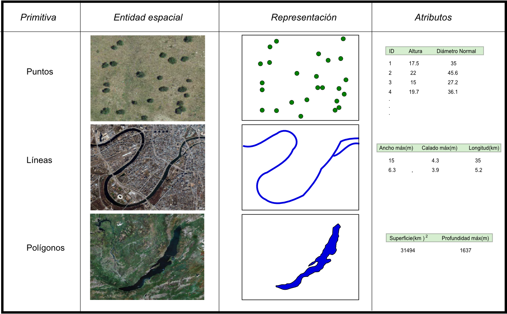

<head>
  <meta charset="UTF-8">
</head>

<style>
  body {text-align: justify;font-family: sans-serif;}
  #header {text-align: center;}
  .footer {text-align: center; padding-top: 7%; padding-bottom: 5%;
  background-color: rgba(80, 110, 120,.5);}
</style>


```{r setup, include=FALSE}
knitr::opts_chunk$set(echo = TRUE)
knitr::opts_knit$set(global.device = TRUE)
Sys.setenv(LANG = "es")
```

<br>


# El modelo vectorial

Es posible distinguir 3 tipos de geometrías en el modelo vectorial para el análisis espacial, estos corresponden a **puntos**, **líneas** y **polígonos**, los cuales hacen referencia a elementos con características particulares y su respectiva representación en el espacio, los polígonos representan elementos unidimensionales como por ejemplo superficies, las líneas representan elementos unidimensionales como por ejemplo calles o ríos, mientras que los puntos representarán la posición de algún objeto en el espacio, por ejemplo, un individuo, el centro de una ciudad e incluso la presencia de algún evento.

{width='100%'}

## Importación de datos puntuales
Existe un gran número de formatos en que se puede importar datos, un ejemplo de estos es el ya conocido **csv** (*Comma Separated Values*), o el versátil **xlsx** de Excel, a continuación se importarán datos desde los formatos csv, xlsx, shp y kml. Para estos ejemplos utilizaremos los materiales encontrados en el repositorio <https://github.com/djwillichile/MODULO_06/tree/gh-pages/DATA>, también pueden acceder a todo el material utilizado para esta actividad mediante el siguiente **[enlace](https://djwillichile.github.io/MODULO_06/DATA/Materiales.zip)**.

## Importar datos desde csv
Este método es uno de los más sencillos de implementar y a la vez, el que permite más formas distintas de realizarlo. utilizaremos el archivo *bradypus.csv*

```{r, include = T,eval=T}
# Asignamos al objeto "path" la ruta del archivo que utilizaremos
path <- "https://djwillichile.github.io/MODULO_06/DATA"

# Asignamos al objeto "file" el nombre del archivo que utilizaremos
file <- "bradypus.csv"

#ruta completa del archivo
fileStrig <- paste0(path,"/",file)
fileStrig

# Leemos el archivo mediante la función "read.csv"
bradypus <- read.csv(file = fileStrig)

# Es posible observar una porcion de los datos cargados
head(bradypus)

```


Cabe destacar que es posible leer estos datos utilizando también la función `read.table()` o `read.delim()`

```{r}
# Leemos el archivo mediante la función "read.table"
bradypus <- read.table(file = fileStrig,sep = ",",dec = ".",header = T)
head(bradypus)

# Leemos el archivo mediante la función "read.delim"
bradypus <- read.delim(file = fileStrig,sep = ",",dec = ".",header = T)
head(bradypus)
```

## Otros formatos para importar
Así como importamos la base de datos a partir de un *csv* que contenía la información, también es posible utilizar distintas extensiones de archivos, como por ejemplo los archivos de texto delimitado (*txt*), la extensión de Microsoft Excel (*xls* o *xlsx*) o extensiones más conocidas en el mundo del análisis espacial como lo son el Keyhole Markup Language (*kml*) de Google Earth o el Shape File (*shp*) de ESRI, los cuales veremos más a delante.

Para las primeras 3 extensiones, la manera en que se pueden cargar los archivos son relativamente parecidas, la gran diferencia es que el archivo de texto delimitado no necesita de paquetes externos al de *r base* para su importación.
A continuación veremos de manera muy resumida como importar la misma base de datos proveniente de distintos ficheros con estas 3 extensiones.

### Archivos de texto delimitado (*txt*)
```{r}
# Asignamos al objeto "fileStrig" ruta completa del archivo
fileStrig <- "https://djwillichile.github.io/MODULO_06/DATA/bradypus.txt"

# Leemos el archivo mediante la función "read.table"
bradypus <- read.table(file = fileStrig,sep = "\t",dec = ".",header = T)
head(bradypus)

# Leemos el archivo mediante la función "read.delim"
bradypus <- read.delim(file = fileStrig,sep = "\t",dec = ".",header = T)
head(bradypus)
```

### Libro de MS. Excel 1997-2003 (*xls*)
```{r}
# cargamos paquete para soportar el formato
library(readxl)

# creamos un archivo temporal en el objeto "temp"
temp <- tempfile(fileext = ".xls")

# Asignamos al objeto "fileStrig" ruta completa del archivo y lo descargamos
fileStrig <- "https://djwillichile.github.io/MODULO_06/DATA/bradypus.xls"
curl::curl_download(fileStrig, temp) # descargar el fichero en el archivo temporal 

# Leemos el archivo temporal mediante la función "read_excel"
bradypus <- read_excel(temp,1)
head(bradypus)
```

### Libro de MS. Excel actual(*xlsx*)
```{r}
# cargamos paquete para soportar el formato
library(openxlsx)

# Asignamos al objeto "fileStrig" ruta completa del archivo
fileStrig <- "https://djwillichile.github.io/MODULO_06/DATA/bradypus.xlsx"

# Leemos el archivo temporal mediante la función "read_excel"
bradypus <- read.xlsx(fileStrig,1)
head(bradypus)
```

<br>
  Es posible apreciar que el objeto `bradypus` es un data.frame común y que no constituye un objeto de tipo espacial
```{r}
class(bradypus)
```
<br>
  Es importante precisar que los datos puntuales requieren contar con al menos 2 variables correspondientes a las coordenadas geográficas verticales (*latitud*) y horizontales (*longitud*), a las que adicionalmente se les puede incluir una tercera variable correspondiente a la coordenada ortogonal de altura (*altitud*). Para este ejemplo es posible apreciar que contamos con la variable horizontal y vertical de coordenadas, *lon* y *lat* respectivamente.

```{r,echo = F}
library(knitr)
kable(head(bradypus), align ="c")

```
## Crear capas espaciales de puntos
  Para crear objetos espaciales a partir de matrices o data.frames con coordenadas espaciales es posible utilizar las funciones `SpatialPoints()`,`SpatialPointsDataFrame()` o `coordinates()`. Es preciso mencionar que para utilizar dichas funciones es necesario llamar al paquete `sp` el cual se carga automáticamente al llamar a los paquetes `raster` y/o `rgdal`. También es necesario que las coordenadas espaciales se encuentren registradas en un único sistema de referencia con su respectivo DATUM y tener muy claro a cual corresponde para evitar problemas al momento de georreferenciar las coordenadas.


```{r, fig.align='center'}
# Cargamos paquetes espaciales
library(raster)
library(rgdal)
library(maptools)

# importamos una capa espacial del mundo para contextualizar
data(wrld_simpl)
par(mar = c(2, 2, 0.1, 0.1))

# Creamos el objeto espacial "bradypus.sp" donde proj4string corresponde al sistema de referencia
bradypus.sp <- SpatialPoints(bradypus[c("lon","lat")], proj4string=crs("+init=epsg:4326"))
bradypus.sp

# graficamos el objeto espacial, cosa que no era posible hacer con el data.frame
plot(bradypus.sp,axes=T,col="blue")

# añadimos a la gráfica la capa espacial del mundo
plot(wrld_simpl,add=T)

# realizamos el mismo procedimiento con la función "SpatialPointsDataFrame"
bradypus.sp2 <- SpatialPointsDataFrame(bradypus[c("lon","lat")], data = bradypus["species"], proj4string=crs("+init=epsg:4326"))
bradypus.sp2

# graficamos
plot(bradypus.sp2,axes=T,col="red")
plot(wrld_simpl,add=T)

# ahora realizamos el mismo procedimiento con la función "coordinates"
bradypus.sp3 <- bradypus
coordinates(bradypus.sp3) <- ~lon+lat
crs(bradypus.sp3)=crs("+init=epsg:4326")
bradypus.sp3

# graficamos
plot(bradypus.sp3,axes=T,col="forestgreen")
plot(wrld_simpl,add=T)
```
<br>
  Cómo habrán podido notar, los 3 métodos permiten obtener resultados muy parecidos utilizando a su vez una sintaxis simple que no requiere mayor análisis, es decir, se requiere la base de datos con coordenadas y el sistema de referencia, la principal diferencia radica en que la función `SpatialPoints()` devuelve solo las coordenadas espaciales georreferenciadas mientras que las otras 2 georeferencian todo el contenido de la base de datos.
  
## Importar capas vectoriales
Ya aprendimos como importar información y crear capas vectoriales a partir de bases de datos puntuales, pero en el mundo del análisis espacial se manejan distintos formatos y archivos con los que van a toparse de vez en cuando, algunos de estos formatos con los ya mencionados *shp* y *kml*, por suerte existen paquetes para importar y manipular dichos archivos, una de las funciones más utilizadas para cargar estos archivos `readOGR()` del paquete `rgdal`

```{r , include=FALSE}
dev.off(dev.list())
```

```{r, fig.align='center'}
# Asignamos al objeto "fileStrig" ruta completa del archivo kml
fileStrig <- "https://djwillichile.github.io/MODULO_06/DATA/bradypus.kml"

# importamos la capa mediante la función "readOGR"
bradypus1 <- readOGR(fileStrig,layer = "bradypus")
bradypus1

# graficamos
par(mar = c(2, 2, 0.1, 0.1))
plot(bradypus1,axes=T,col="blue")
plot(wrld_simpl,add=T)

# Asignamos al objeto "fileStrig" ruta completa del archivo shp
fileStrig <- "https://djwillichile.github.io/MODULO_06/DATA/bradypus.shp"

# importamos la capa mediante la función "readOGR"
bradypus2 <- readOGR("DATA/bradypus.shp",encoding = "ESRI Shapefile")
bradypus2

# graficamos
par(mar = c(2, 2, 0.1, 0.1))
plot(bradypus2,axes=T,col="red")
plot(wrld_simpl,add=T)
```
<br>
Como ya habrán visto, la importación de estos datos espaciales sigue el mismo patrón, la función `readOGR()` requiere el nombre del archivo y algunas veces la codificación de este para que no se desconfigure la base de datos no espacial asociada al archivo, de todos modos podrán revisar el detalle de esta función incorporando un sigo de interrogación antes de la función (`?readOGR()`) u ocupando la función help (`help("readOGR")`)

# El modelo raster
Como ya fue mencionado en el módulo anterior, el modelo raster corresponde a una representación matricial de elementos o fenómenos que poseen algún tipo de expresión espacial, esto tiene una serie de ventajas, como por ejemplo, que el análisis matemático y lógico de este modelo es mucho más simple que en el modelo vectorial, de hecho, esa ventaja es la que nos impulsa a desarrollar el **análisis multicriterio** utilizando este modelo de representación espacial. es así que procederemos a estudiar la importación de imágenes raster a partir de distintos formatos, además de las distintas operaciones aritméticas y lógicas básicas que podemos aplicar a las imágenes representadas mediante el modelo espacial raster.

## Importación de archivos raster
Cabe destacar que existen 2 principales tipos de archivos raster, por un lado están los de tipo monobanda (también conocida como single band), es decir, que cada archivo contienen una única imágen raster, mientras que por otro lado existen los de tipo multibanda (multi band), lo que quiere decir que dentro de ese archivo coexisten varias imágenes agrupadas de distinta maneras, inclusive, con distinta resolución.

a su vez, los archivos raster podrían tener distintas extensiones dependiendo del proveedor de servicios, el proceso realizado, e inclusive el software utilizado para su procesamiento. A continuación se presenta un listado con los principales archivos en que es posible almacenar información raster.

|Tipo|Descripción|Extensión|Soporta multibanda|
|:------------:|:-----------:|:------------:|:------------:|
| *raster*| Formato raster nativo| .grd| Si|
| *ascii*| ESRI Ascii| .asc| No|
| *SAGA*| SAGA GIS| .sdat| No|
| *IDRISI*| IDRISI| .rst | No|
| *CDF*| netCDF (require `ncdf4`)| .nc| Si|
| *GTiff*| GeoTiff (require `rgdal`)| .tif| Si|
| *ENVI*| Extensión hdr de ENVI| .envi| Si|
| *EHdr*| Extensión hdr de ESRI| .bil| Si|
| *HFA*| Imágenes de Erdas| .img| Si|

Es preciso declarar que para efectos prácticos no trabajaremos con los formatos *netCDF*, *hdr* ni *Erdas*, ya que estos formatos son poco utilizados al momento de realizar análisis multicriterio y aceptan distintas formas de alacenar las imágenes, las cuales no daría tiempo de estudiar en este módulo.

## Importar de archivos monobanda


## Importar de archivos monobanda


```{r , include=FALSE}
dev.off(dev.list())
```

```{r, fig.align='center'}
# Asignamos al objeto "fileStrig" ruta completa del archivo tif
fileStrig <- "https://djwillichile.github.io/MODULO_06/DATA/LANDSAT_5.tif"

# Importamos el archivo con la función "stack"
LANDSAT <- stack(fileStrig)
LANDSAT

# Graficamos la primera banda
plot(LANDSAT[[1]],legend.width=2)

# Graficamos 3 bandas en RGB
plotRGB(LANDSAT, stretch = "lin",
        r = 3, g = 2, b = 1)
box()

# Asignamos al objeto "fileStrig" ruta completa del archivo grd
fileStrig <- "DATA/bio.grd"

# Importamos el archivo con la función "stack"
bio <- stack(fileStrig)
bio

```


<br>

<div class="footer">Copyright &copy; Guillermo S. Fuentes Jaque 2021</div>